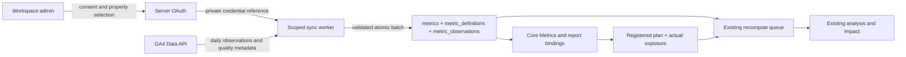

# GA4 → core metrics → analysis

Status: GA01–GA04 implementation and SEC01 source/local review are delivered in the next stacked draft PR. [Engineering evidence](../reviews/2026-09-21/GA4_ENGINEERING_REVIEW.md) and the [operator runbook](../integrations/google-analytics.md) supersede the planning status below. Real Google acceptance and hosted security verification remain open. The original acceptance contract is retained here.

## Outcome and scope

A workspace admin connects their own Google Analytics account, chooses a GA4 property and metrics, previews real daily observations, and confirms import. Those observations become selectable Core Metrics and feed the existing report, measurement, and Impact paths. Sync continues without the user being present. Disconnect stops further collection.

Start with one property per connection and daily `sessions`, `engagedSessions`, and `eventCount` with an optional selected event filter. Each mapping has its own immutable definition. Additional metrics need explicit aggregation semantics; do not sum daily unique users into a quarterly unique-user count. Keep the current Impact models. BigQuery, new models, and combined portfolio attribution are outside this slice.

## Build sequence

| Step | Implementation | Acceptance |
|---|---|---|
| GA01 · Connect | Separate connector authorization from Causent login. Server OAuth with `analytics.readonly`, offline access, expiring single-use state bound to user/workspace, exact redirect allowlist, and consent-error recovery. List accessible properties with pagination and recheck access before binding one. | A user cannot bind another tenant's connection or an inaccessible property. Refresh and revoked consent produce clear states. |
| GA02 · Store | Add scoped connection metadata, metric mappings, sync jobs/receipts, and encrypted private credentials. Keep tokens outside exposed schemas/client responses. Bind each mapping to connection, property, metric/filter, timezone, definition, and Causent metric ID. | Explicit grants/RLS and worker permissions pass real cross-tenant tests. Credentials never appear in logs, bundles, browser storage, or PR evidence. |
| GA03 · Sync | Backfill up to 180 completed property-local days, then daily sync with a configurable seven-day overlap for revisions. Stage complete paginated responses, validate dates/finite values/quality, and publish atomically through a connector-specific writer. Deduplicate by mapping/date and reject stale job generations. | Retry and concurrent sync do not duplicate or partially publish data. Late revisions are audited; disconnect invalidates pending work before commit. |
| GA04 · Analyze | Create `source='connector'` metrics and confirmed definitions. Use existing core selection and activation bindings. Commit observation changes before waking recompute; retain durable queue fallback. Show last sync, coverage, and quality in the actual app. | Real provider values reach Data, Core Metrics, report charts, and the existing analysis input. Insufficient history or incomplete measurement stays pending/withheld. |
| SEC01 · Review | Run the security scope below against the final implementation and staging configuration. Fix verified findings and add regression coverage. | Report records scope, commit, evidence, severity, remediation, and unchecked surfaces. Unresolved high-impact findings block release. |

Use Google's [server OAuth flow](https://developers.google.com/identity/protocols/oauth2/web-server) and [Admin API property discovery](https://developers.google.com/analytics/devguides/config/admin/v1/rest/v1beta/accountSummaries/list). Preserve an existing refresh token when a successful reauthorization omits a replacement. Revalidate Causent membership for configuration changes and queued work; Google consent does not grant Causent workspace access.

## Data contract

Store provider property ID, property timezone, requested date range, metric/filter specification, fetch time, row count, completeness, and a content digest with each sync receipt. Daily dates stay property-local; do not relabel them as UTC days. Definition changes create a new mapping/metric version rather than rewriting an active measurement contract.

Request explicit `date` ordering, bounded pagination, and property quota metadata using [runReport](https://developers.google.com/analytics/devguides/reporting/data/v1/rest/v1beta/properties/runReport). `keepEmptyRows` does not prove every omitted day is zero. Preserve gaps as missing; never synthesize a continuous series from an incomplete response. Bound retries and concurrency per property, with backoff for throttling and retryable failures using Google's [quota guidance](https://developers.google.com/analytics/devguides/reporting/data/v1/quotas).

Persist thresholding, sampling, truncation, restricted-metric, and other-row quality flags from [response metadata](https://developers.google.com/analytics/devguides/reporting/data/v1/rest/v1beta/ResponseMetaData). The first release should withhold these series from confident analysis until a documented quality policy permits them. Recent observations remain revisable. Historical reports must keep the input digest and sync provenance used by their evaluation.

Do not send credentials or user-level GA identifiers to AI. Use daily aggregates only. Connection/import completion does not create a prediction, register a measurement plan, or prove rollout exposure. Preserve the existing prospective registration and 45–180-day-per-side rules; a successful import can legitimately produce a pending result.

## Repository seams

| Existing source | How to use it |
|---|---|
| `app/(dashboard)/data-workshop/` and `lib/auth/session.ts` | Implement the live connection flow here. Proposal D is the visual contract, not a backend client. |
| `lib/metrics/definition.ts`, `lib/metrics/import.ts` | Reuse validation and `setWorkspaceCoreMetric`; CSV receipts are a pattern, not the GA writer. Existing CSV paths intentionally reject connector-owned metrics. |
| `public.metrics`, `metric_definitions`, `metric_observations` | Existing analysis spine. Connector metadata, receipts, credentials and leases are added by `20260922000213_ga4_core_metrics.sql`. |
| `lib/data/metrics.ts`, `lib/data/metric-history.ts` | Preserve bounded complete reads and missing-data reporting. Replace fixture-based connection counts in `lib/data/metric-connections.ts`. |
| `lib/causal/recompute.ts`, `engine/persistence/recompute.py`, `engine/persistence/measurement.py` | Retain scoped queue admission, stale-work rejection, evidence authority, and fixed-horizon evaluation. Verify the connector writer has an authorized actor/context for enqueue triggers. |
| `app/(dashboard)/data-workshop/measurement-actions.ts` | Keep user-approved plans and actual exposure distinct from connector synchronization. |

## Security acceptance scope

| Surface | Evidence required |
|---|---|
| Database and storage | Live grants/RLS/view/RPC review; owner/admin/member/viewer/outsider cases across two tenants; private credential access; archived workspace and deleted membership denial. Check Data API exposure separately from RLS. |
| OAuth and jobs | State replay, callback tampering, property substitution, token refresh races, revocation, cross-tenant job IDs, disconnected/stale job writes, and worker least privilege. |
| Frontend and routes | Session authorization on every mutation; XSS/link safety in report editors, imported labels and charts; CSRF/redirect protections; public bundle and logging secret scan; upload/URL fetch boundaries. |
| Infrastructure and dependencies | Supabase security advisors, deployed auth/Storage/CORS/security-header settings, preview/production secret separation, worker authentication, dependency advisories, and clean CI. Record anything inaccessible as unverified. |

Use [security-and-auth.md](../designs/security-and-auth.md), `lib/decision-reports/sources/url.ts`, `lib/supabase-server.ts`, the adversarial RLS/measurement-tenancy tests, and the CI app/engine/bridge gates. Follow [Supabase's API security guidance](https://supabase.com/docs/guides/api/securing-your-api). Run authorized read-only staging checks; keep destructive probes on isolated fixtures.

## Completion and release

The next PR must demonstrate consent → property → backfill → core selection → real analysis input → refresh → disconnect using an authorized GA4 property, with redacted evidence. Also test missing dates, thresholding, pagination, timezone boundaries, retries, late revisions, stale workers, and denied cross-tenant access. Mock tests alone do not establish provider acceptance.

Operator setup: enable the Analytics Data/Admin APIs, register the connector OAuth client and redirect URLs, configure encrypted credential storage, and provide an authorized test property. Record any Google consent-screen verification requirement before public access. Keep these prerequisites separate from Causent's existing Google login setup.

Ship additive migrations and the sync worker behind a disabled-by-default connector flag. Rehearse on staging, then enable one consenting workspace. Rollback disables new connections/sync, invalidates pending jobs, and revokes or deletes credentials through the approved disconnect path; retain necessary metric/evaluation provenance. Production migration, worker release, and application promotion remain explicit release steps.
