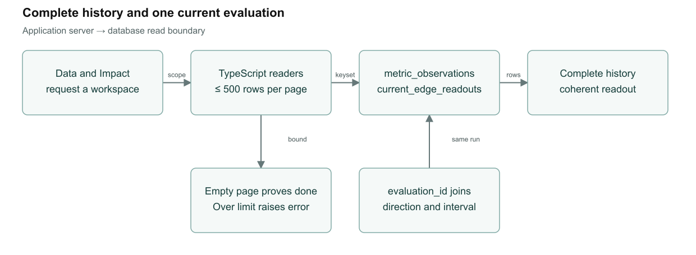
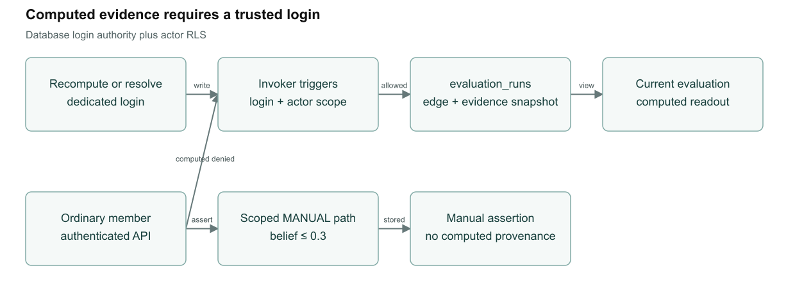
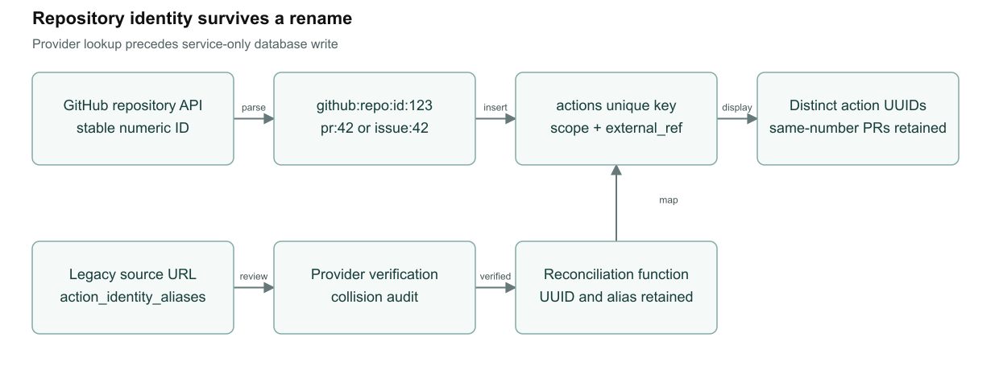
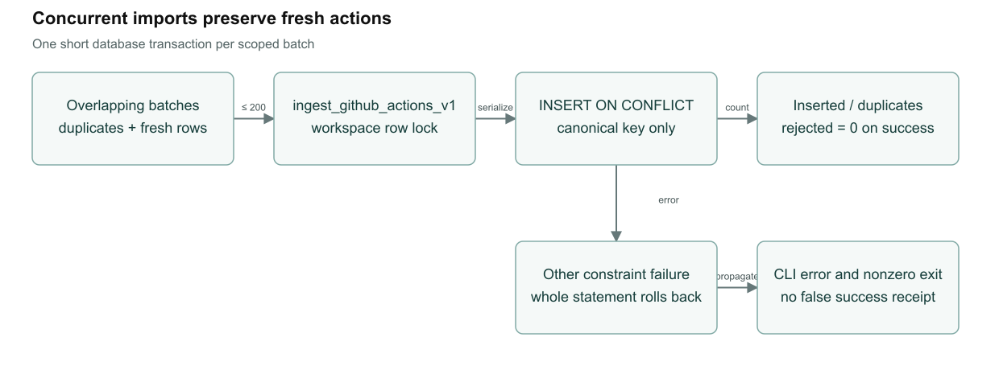

# Causent T01 to T04 implementation

## State and scope

Implemented and locally verified on `codex/t01-t04-integrity`, based on remote main `2c2b1bfd9b91e5250d4736a6d1b1e341812aa29f`. This branch is for a draft PR and owner review. Nothing here establishes a merged or deployed release. The original checkout and earlier T01–T10 reference implementation remain untouched.

Causent retains its report-native, explicitly activated decision workflow and controlled demo workspace selection. These four fixes repair reading and evidence/ingestion integrity. They do not establish causal identification, remove the 200-action engine family cap, change exposure timing or metric semantics, revise the unchanged-input recompute hash, or generalize customer provisioning. T05–T10 and all P2 findings remain deferred.

## T01 complete bounded reads

`collectKeyset` requests at most 500 rows ordered by a unique cursor. Only an empty next page proves completion, including when the server imposes a smaller page cap. Failed requests, non-advancing cursors and a bound overflow throw; callers cannot render a partial successful result. Metric history supports inclusive date bounds. Current callers preserve the existing full-history behavior, bounded at 10,000 observations per metric, 100 metrics per workspace, and 10,000 action/graph rows. Histories load four metrics at a time. The UI range label includes both years for a multi-year series.

`readMetricHistory` returns row count, limit, window and `consistency: keyset`. `getMetricRecords` retains this metadata; `loadGraphReadouts` exposes a complete readout map and metadata, while the existing `loadEdgeReadouts` adapter returns its map only after completion. This is a finite traversal, not a cross-request snapshot: concurrent insertions behind an already-read cursor may require a refresh. A bound overflow is visible, and the current UI does not offer a new server-window picker.

`current_edge_readouts` performs a single-statement projection for each page. Direction, belief and reason are captured when evidence is written. ITS intervals and optional before/after values join only to the edge's current evaluation. Equal timestamps sort by evidence UUID as a deterministic second key. Legacy, manual and incomplete evaluations return neutral computed fields. No new verified provenance is invented for old rows.

A fresh-import test exposed a pathological node join before PostgreSQL analyzed new rows. Parameterized one-row lateral lookups preserve node identity semantics and prevent that join from repeatedly evaluating RLS across the whole action set. `(scope_id, edge_id)` supports ordered traversal. This fixes the tested read contract; it is not a production capacity benchmark.



## T02 computed evidence authority

Invoker triggers require a dedicated recompute/resolve database login for computed writes, plus the existing initiating-actor RLS scope. `session_user` survives `SET ROLE`; forged JWT/GUC fields cannot create that capability. Database owners retain explicit maintenance authority. Service-only ingestion remains separate and cannot insert evaluation runs.

The Python bridge records the exact consumed daily values using hexadecimal float strings, observation dates, action IDs/effective dates/splits, hypothesis family, selected outputs, scope and metric in an immutable input manifest. SHA-256 identifies the manifest; a separate model identifier hashes the shipped causal files and bridge and records NumPy's version. This binds outputs to an execution; it does not alter T09's existing skip-cache identity or claim complete environment reproducibility.

Graph node identity and edge endpoints/scope cannot be reassigned. A member cannot update a computed edge, relabel it as manual or insert ITS/before-after evidence. Scoped manual evidence remains available; manual edges retain the existing 0.3 belief ceiling. Manual evidence cannot declare computed provenance and never drives the computed view. Worker result writes and generation receipts retain their surrounding transaction.

The guard uses indexed point checks instead of a combined join that scanned all actions per inserted edge. The same scope/type/metric checks remain enforced. New tests authenticate as actual separate database logins, because owner `SET ROLE` alone cannot prove the login authority boundary.



## T03 stable GitHub identity

The backfill fetches the repository's numeric GitHub ID before parsing candidates. Canonical references include provider, repository ID, kind and number, for example `github:repo:id:123:pr:42`. A repository rename or transfer with the same ID retains identity. PR 42 in another repository gets another action UUID. Display identity uses that UUID while preserving the human-readable PR/issue label.

The additive migration records old `github:pr:N` and `github:issue:N` values in `action_identity_aliases`, preserving their existing action UUID and source URL. It marks them unresolved instead of guessing a repository. The service-only reconciliation function checks stored provenance, entity kind/number/source and collisions, preserves the old alias, and updates only the canonical reference. A collision fails visibly without merging histories. Unresolved same-kind/same-number aliases conservatively block incoming candidates until provider verification resolves the ambiguity.

[Migration and reconciliation guidance](T01_T04_MIGRATION.md) includes the local collision report and the read-only [identity audit](IDENTITY_AUDIT.sql). The old parser's merge/close date behavior is unchanged; exposure semantics remain T07.



## T04 atomic overlapping imports

`ingest_github_actions_v1` accepts at most 200 canonical action candidates from one workspace. It takes a short workspace row lock shared with identity reconciliation, then inserts with `ON CONFLICT` targeted specifically to `(scope_id, external_ref)`. Provider I/O occurs before this transaction. The result reports inserted, duplicate and rejected counts. Successful batches have zero rejected rows; invalid batches throw atomically.

The application retains the pre-read as an optimization. The database decides concurrent conflicts, and the final receipt counts both pre-existing and racing duplicates correctly. Unrelated unique/check/foreign-key failures remain errors. Concurrent mixed batches in the test produce three fresh actions and three duplicates in total; an unrelated unique failure rolls back every row in that statement.



## Runtime and logging

| Placement | Components | Actual behavior |
|---|---|---|
| Browser | React 19.2.4 and TypeScript | Existing Data/Actions/Impact UI consumes complete server results; no new raw-data telemetry |
| App server | Node 22.23.0, Next.js 16.2.11, Supabase JS 2.104.1 and SSR 0.10.2 | Keyset reads and receipt validation; no new per-page logging; failed reads propagate through existing error handling |
| Database | Supabase PostgreSQL, SQL and PL/pgSQL | RLS, invoker triggers, immutable evaluation records, latest-result view and atomic import functions; SQLSTATE errors rather than payload logging |
| Workers | Python 3.12.14, NumPy 2.5.0, psycopg 3.3.4 | Existing separate recompute/resolve Vercel bundles; evaluation manifests persist in scoped tables, not process logs |
| CLI and operations | GitHub transport, ingestion CLI, worker endpoints | CLI prints JSON counts to stdout and errors to stderr with nonzero exit. Recompute emits bounded event/error metadata to stderr and returns activation/generation/status receipts. Resolve returns scope/prediction/status summaries and suppresses default access logging. No new request-body, observation, token or environment-value logging was added. |

No dependencies were added and no license review is claimed. Existing statistical code, 45-observation gates, HAC intervals, placebo checks, FDR family and clustering behavior are preserved.

## Acceptance and evidence

| Contract | Evidence | Result |
|---|---|---|
| T01 history over API cap | Authenticated CSV import/read; plain-query 1000-row positive control | 1501 observations, exact final date/value and inclusive windows |
| T01 graph over API cap | Authenticated graph fixture and shared production query | 1001 edges, complete traversal and foreign-scope denial |
| T01 deterministic evaluation | Actual worker fixture with 1501 equal-timestamp evidence rows | Direction, belief, lift, interval and run stay coherent; old run cannot win |
| T02 authorization | Actual member, recompute and resolve logins | Both workers pass; member computed writes/forged claims/relabeling fail; scoped manual path passes |
| T03 identity and legacy | Parser fixtures, migration upgrade, reconciliation/collision tests | Same number across repositories retained; rename stable; UUID/aliases preserved; collision rejected |
| T04 concurrency | Two simultaneous mixed duplicate/fresh RPC batches | 3 inserts + 3 duplicates; no fresh row lost; unrelated constraint error rolls back |
| Application suite | [Final log](verification-t01-t04/app-final.log) | 688 passed, 19 intentional live-model skips, 0 failed |
| Engine and DB suite | [Final log](verification-t01-t04/engine-final.log) | 1300 passed, 0 skipped |
| Static/build checks | [Typecheck](verification-t01-t04/typecheck-final.log), [lint](verification-t01-t04/lint-final.log), [build](verification-t01-t04/build-final.log), [route contract](verification-t01-t04/dashboard-final.log) | Passed; dashboard routes remain request-bound |
| Schema and bundles | [Replay](verification-t01-t04/migration-final-replay.log), [lint](verification-t01-t04/schema-lint-final.log), [bundles](verification-t01-t04/worker-bundles-final.log) | Final replay and checks passed; no deployment |
| Local browser | [Browser record and inspected screenshots](verification-t01-t04/BROWSER.md) | CSV/history, Actions/Impact/Reports and workspace switching passed in local demo mode |

The 19 skipped tests explicitly require live model credentials; they are not counted as passes. No database integration test skipped. Live GitHub replay, authenticated browser acceptance, partner validation, production catalog parity, production load/lock duration and restore acceptance were not performed. Hosted checks will be assessed on the pushed draft PR separately.

## Reproduce without touching a shared database

Use Node 22.23.0, Python 3.12, and Supabase CLI 2.98.1. Create an independently named local stack with unique ports and the repository migration chain. Set `CAUSENT_TEST_DATABASE_URL` for engine tests and `DATABASE_URL` for seeding to that stack; set the local API/anon/service test credentials for application integration tests. Keep credentials outside the repository. The existing `db:reset-demo` script targets its default stack; do not run it against a shared development environment.

```text
supabase db reset --workdir <isolated-stack-directory> --local
cd engine
python persistence/seed_demo.py
python -m pytest -q
cd ..
npm run typecheck
npm run lint -- --max-warnings=0
npm run test:load-contract
npm test
supabase db lint --workdir <isolated-stack-directory> --local --level error
npm run build:webpack
npm run check:dashboard-build
```

The CI workflow also validates release configuration and stages all three stateful worker bundles. Stage-only checks perform no deployment. Locally, dependencies were reused from a matching lockfile installation; hosted CI performs `npm ci`. Python used pinned worker NumPy/psycopg versions; pytest and SciPy are test-only dependencies. Node reports the repository's existing module-type warning. Next development could not inherit Node's `--env-file` through its child-process options, so the local launcher supplied the same credentials through an environment object; production webpack build succeeded. Do not build and run development output concurrently in one `.next` directory.

## References

- [Current product/release status](../../STATUS.md), [engineering standards](../../ENGINEERING.md), [schema report](../../../supabase/SCHEMA_REPORT.md).
- [Decision Report PRD](../../designs/ai-assisted-decision-report.md), [graph contract](../../designs/decision-graph.md), [security design](../../designs/security-and-auth.md).
- [September 6 technical review and recommended order of work](reference/TECHNICAL_REVIEW.md); [source context](reference/README.md). The review provides a sequence, not a dated roadmap.
- [Migration/backfill/rollback plan and collision report](T01_T04_MIGRATION.md), [progress](T01_T04_PROGRESS.md), editable diagrams alongside SVG/PNG in [figures](figures-t01-t04/).
- Practices applied: unique ordered keysets, explicit failure at bounds, actor-scoped RLS plus separate login authority, append-only result snapshots, narrowly targeted conflicts, actual-login adversarial tests and full pinned-toolchain checks. No general architecture rewrite or deferred scientific/tenancy change was included.
