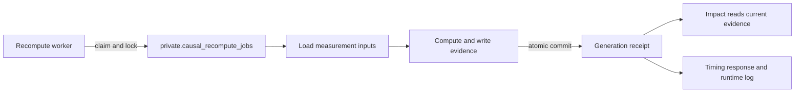
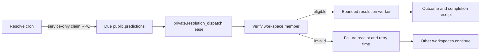
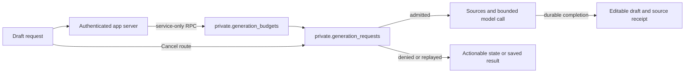
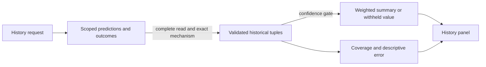

# T11–T14: bounded AI generation and reliable background work

## Overview

Causent now has durable admission controls for paid report generation, independent retry scheduling for resolution workspaces, recompute timing, and a more accurate history summary. These changes address the four remaining engineering findings from the September 6 review. The implementation builds on merged PR #34 (`dd1901db247d5ca824d0a8419497d94113d13127`) in `codex/p2-and-ux-review`.

The local application, database, engine, and production-build checks pass. Merge, production migrations, worker deployment, and application promotion remain separate release states. The accompanying [UX review](UX_REVIEW.md) and [interactive proposal](ux-proposal/index.html) recommend a substantial document-centered redesign; they do not implement it. Visible engineering changes are limited to generation cancellation and denial messages, plus clearer History copy.

## Executive Summary

- **T11 — measurable recompute transactions.** Phase timings and a conservative lock-duration upper bound are implemented and tested. One local fixture measured about 86 ms. Representative load and the later snapshot/compare-and-swap redesign remain open.
- **T12 — independent resolution progress.** Durable workspace leases, fair ordering, failure receipts, and retry delays prevent an invalid workspace from stopping unrelated eligible work. Database and poison-workspace tests pass.
- **T13 — bounded generation.** Authenticated requests now reserve an organization budget before source retrieval or model invocation. Durable identity, replay, cancellation, and concurrency checks survive multiple app instances. Provider cost reconciliation and customer-value measurement remain unimplemented.
- **T14 — honest historical evidence.** All-inconclusive history withholds a weighted recommendation; malformed and observational tuples are excluded. Coverage and descriptive forecast error are exposed. Prospective calibration, realized utility, and transferable learning remain unvalidated.

## Next Steps

1. Review the scoped PR and require its hosted checks to pass on the submitted commit. Confirm the cancellation and History presentation in an authenticated preview.
2. For a separately authorized release, rehearse the two additive migrations against the actual target baseline, then release the recompute worker and application using the [runbook](T11_T14_RUNBOOK.md). Verify budgets, independent resolution progress, and worker timing before broader exposure.
3. Review the document proposal, then implement the first UX group: one report workspace, continuous paragraphs, contextual AI, typed charts, concise controls, and evidence-preserving acceptance. Carry the shared pattern into the other tabs afterward.
4. Collect representative lock measurements and prospective decision outcomes. Use those observations to decide whether to shorten transactions and whether historical recommendations improve decisions. Neither conclusion follows from this test run.

## Analysis

### Build and verification method

The work used one task with separate build and test phases. Current code was checked against each original finding before editing. T05–T10 had already excluded observational results from causal priors, so T14 preserved that boundary. Changes were reviewed independently for database authorization, cancellation races, fairness, and transaction timing. The UX pass combined source inspection with authenticated desktop and phone-width screenshots of synthetic local data.

Review found three material edge cases: cancellation depended on the currently selected workspace; replay could return an expired source receipt; and cancelling locally could release capacity while a provider continued processing. Cancellation now resolves the request's own workspace from the verified actor, replay checks receipt expiry, and uncertain calls occupy their slot until lease expiry. A separate review corrected the lock bound to include the claim round trip and moved success telemetry after durable completion.

The application suite passed **710 tests**, with **19 optional live-model skips** and no failures; the engine passed **1,324 tests**. Eight new real-database tests cover permissions, independent connections, leases, receipts, and actual lock contention. TypeScript, zero-warning lint, load contracts, schema lint, webpack build, dashboard build, and the staged recompute worker import passed. An old webhook test initially failed because its fixed delivery ID survived repeated runs; it now creates and cleans up its own unique delivery. No paid-model, production, or partner acceptance is claimed.

### T11 — observe contention before changing consistency

The Python worker still commits computed evidence and the processed generation atomically. It now records claim, target lookup, input loading, analysis/write, post-claim, and total milliseconds. `lock_held_upper` includes the whole pre-claim-to-post-commit interval; it is deliberately conservative and is not continuous sampling of PostgreSQL locks.

The `causent.recompute` logger emits JSON containing `event`, result status, and numerical timings. Calls at or above 1,000 ms use warning level; shorter calls use info, subject to runtime logging configuration. Authorized worker responses also include timings. These additions log no workspace identifiers, source text, or measurement values. A controlled test delays claim return while a second connection fails to acquire the held row, proving the upper bound includes that interval. The roughly 86 ms fixture is diagnostic evidence, not a throughput estimate or production percentile.

### T12 — quarantine failure without blocking progress

The application cron claims up to 20 due workspaces in least-recently-attempted order. A short discovery transaction assigns six-minute leases in `private.resolution_dispatch`; actor lookup and worker execution happen afterward. Each target has its own authorization decision and completion receipt. Missing actors wait an hour; transient failures back off from one minute to an hour; successful work waits five minutes before rediscovery. At most four workers run concurrently.

Claim tokens prevent late completions from updating a newer lease. The row stores current attempt state, failure count, and an allowlisted error code, rather than an append-only event history. Production cron output remains aggregate and excludes actor/workspace identities. Tests show that an invalid first workspace is recorded while a later valid workspace proceeds, and that duplicate claims, stale completions, and retry windows are enforced by the database.

### T13 — reserve capacity before paid work

PostgreSQL serializes admission by actor and organization. Defaults are one occupied request per actor, three per organization, ten starts per minute, and $20 of daily UTC reservations per organization. Each paid request reserves $2; approved local fixtures reserve zero. The reviewed model and serialized input/output limits define a conservative cost envelope. These are application reservations, not measured provider invoices.

Private request rows bind the verified actor, workspace, input digest, model, and result. Direct table access is revoked, including for the service role; only narrowly granted functions expose state transitions. The browser supplies a stable request ID so a lost response can replay the completed draft without another paid call. Expired source capabilities require an explicit new request. Cancellation uses a separate authenticated same-origin route because this Next.js version serializes client Server Actions.

Cancelled, failed, fallback, or retried requests keep their concurrency occupancy for the original three-minute lease because upstream work may persist. All reservations remain charged for the day. This conservative behavior can temporarily deny another request after cancellation; the UI reports it. Tests include six simultaneous database connections admitting exactly one request for an actor, tenant caps, foreign ownership, cancellation/completion races, and cancellation when the provider ignores abort.

### T14 — separate useful history from validated learning

Historical tuples are now checked for finite, valid values and matched within the exact mechanism, including an explicitly unspecified mechanism. Complete bounded pagination replaces a silently capped history read. The aggregate withholds its weighted mean and bias until at least one measurement has the policy's highest confidence bucket. That bucket remains an ordinal rule, not a calibrated probability.

The History panel reports evaluation coverage and descriptive error. It avoids presenting past overprediction as an established property of the team or evidence of future accuracy. Tests cover all-inconclusive classes, mixed outcomes, malformed inputs, and observational exclusion. Recommendation acceptance, decision changes, realized utility, and comparable-mechanism holdouts still require prospective instrumentation and real outcomes; the UI repair does not validate the learning thesis.

## Appendix

| Task | Local acceptance | Remaining evidence |
|---|---|---|
| T11 | Phase contract, held-lock regression, fixture timing | Representative p95, user-write blocking, future snapshot/CAS design |
| T12 | Poison target isolation, fairness, leases, backoff, service ACLs | Hosted authenticated scheduling and operational volume |
| T13 | Atomic admission, replay, budget, ownership, cancellation, expiry | Paid-provider acceptance, invoice reconciliation, value per customer |
| T14 | Contract repair, coverage/error, comparable history, clear labels | Prospective calibration, acceptance, utility, out-of-sample transfer |

- [Plan and timeline](T11_T14_PLAN.md), [release and verification runbook](T11_T14_RUNBOOK.md), [UX review](UX_REVIEW.md).
- [Original technical review, T11–T14](../2026-09-06/reference/TECHNICAL_REVIEW.md), [engineering handbook](../../ENGINEERING.md), [Decision Report requirements](../../designs/ai-assisted-decision-report.md), [prediction-loop design](../../designs/prospective-prediction-loop.md).
- Main stack from the lockfile: Next.js 16.2.11, React 19.2.4, TypeScript 5.9.3, AI SDK 7.0.34, Supabase JS 2.104.1, Tiptap 3.30.1. Verification used Node 22.23.0 and Python 3.12. Worker bundles pin NumPy 2.5.0 and psycopg 3.3.4. No dependency or license change is included.
- Applied engineering guidance: installed Next.js documentation for Server Actions and environment handling; Supabase guidance for least-privilege functions and short transactions; React checklist for pending-state rendering; independent adversarial review. The Mermaid blocks above are editable figure sources.
- Commit, PR, and hosted-check evidence are recorded in [HOSTED_VERIFICATION_T11_T14.md](HOSTED_VERIFICATION_T11_T14.md) after submission. This report's test counts describe the local implementation checkpoint.
