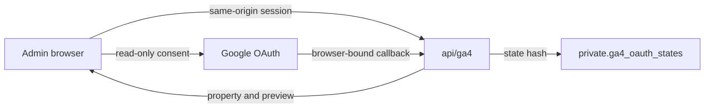
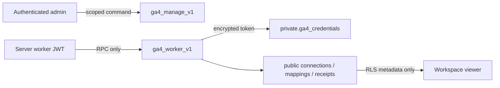
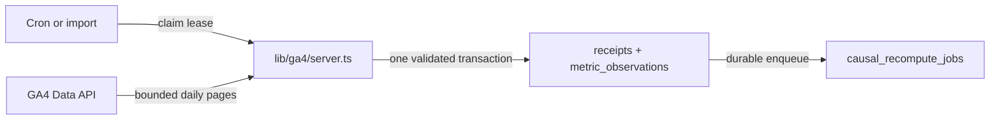
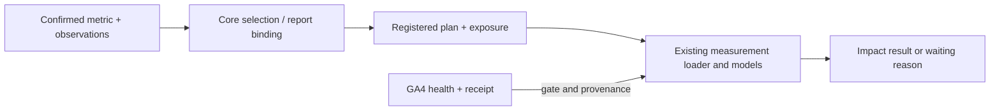
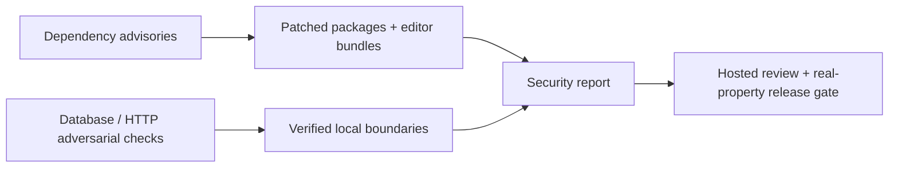

# GA4 and security engineering review

## Overview

The next implementation slice connects customer GA4 daily observations to Causent's existing metric and analysis contracts. Data Workshop now has an admin-only connection, preview/import and sync/disconnect flow. Credentials and provider writes stay behind dedicated server/database boundaries. The analysis models are unchanged; property-local dates and provenance now survive the pipeline.

Submission: [draft PR #37](https://github.com/Causent-AI/causent-ai/pull/37), implementation `1bea0928e0be0c8e77e8c8c674a5880a596c63b0`. Hosted results are attached to the PR head.

Baseline: `01535f2`, parent [PR #36](https://github.com/Causent-AI/causent-ai/pull/36). This delivery is implemented and locally tested, with [full hosted CI](https://github.com/Causent-AI/causent-ai/actions/runs/35674382314) and both previews passing on `d0c431c`. Subsequent evidence-only commits are tracked on the PR. It is not merged, enabled or deployed to production. Real Google consent/property acceptance remains pending operator setup.

## Executive summary

- **GA01:** OAuth, accessible-property discovery and preview/import controls implemented. Live Google acceptance remains open.
- **GA02:** Encrypted private credentials, tenant-scoped metadata, immutable mappings/receipts and a dedicated RPC-only worker role implemented; real database/Data API denial checks pass.
- **GA03:** Complete bounded imports, property-local backfill/overlap, leases, retries and disconnect invalidation implemented. Concurrent claims and atomic rollback pass.
- **GA04:** Imported metrics feed existing Core Metrics, report bindings and measurement input. Revised, stale or restricted inputs withhold results; existing statistical models and prospective requirements remain.
- **SEC01:** Source/local security review completed and verified dependency findings patched. Final npm audit reports zero vulnerabilities. Hosted catalog/Storage checks passed; advisors returned 33 warnings requiring the documented deployment follow-through. Remaining configuration remains a release gate.

## Next steps

1. Review this stacked PR after #35 and #36; retarget as parents merge and rerun checks against the resulting base.
2. Configure staging with the [GA4 operator runbook](../../integrations/google-analytics.md), apply its migration and deploy the matching recompute worker. Verify hosted security settings and token rotation.
3. Run consent → real-property comparison → core selection/analysis input → refresh → disconnect. Enable customer use only after redacted acceptance evidence passes. No dates or production release are implied by this review.

## Analysis

The [decision record](GA4_DECISIONS.md) explains the alternatives, tradeoffs and findings that changed the implementation.

### Build and verification method

Implementation followed a separate build and test phase from the [plan](GA4_PLAN.md). Provider requests are isolated behind a fetch-injectable TypeScript adapter; PostgreSQL enforces authorization and publication independently. Python consumes the resulting metric spine. A disposable Supabase project was reset and seeded, leaving the existing user review database intact. The local permission-hint crash required the existing CI workaround for Supabase's `supautils`; permission checks remained enabled.

Local checks used Node 22.23.0 and Python 3.14; CI pins Python 3.12. Final hosted suites passed: 726 application tests with 19 optional live-model skips, 1,338 engine tests, and 12 prototype tests. Locally, all 14 connector database tests and 18 focused Node tests passed. Typecheck, zero-warning lint, 12 prototype tests, production webpack build, schema lint and both editor rebuilds pass. Final commit CI is the authoritative full rerun.

C/D browser checks verified paragraph editing, toolbar availability and D title-to-folder synchronization. The live Data Workshop rendered against a synthetic authenticated workspace. Separate local HTTP probes passed origin/body/callback/header/cron checks. Browser disconnect feedback also passed. The HTTP checks caught and fixed a global-header override of the callback referrer policy. No real Google account was used. Provider payload fixtures prove parsing and quality behavior, not Google acceptance.

### GA01 · Connect

The browser sends user choices to authenticated, same-origin Next routes. Consent state is bound to browser, actor, workspace, connection generation and expiry. Google property access is rechecked before binding. An `openid` subject prevents an omitted refresh token from silently reusing another Google account's grant.

### GA02 · Store

Public connection/mapping/receipt rows use workspace RLS. Refresh tokens use AES-256-GCM with connection/workspace binding in the private schema. The app holds an expiring dedicated worker JWT; direct table permissions are absent. Membership is locked/revalidated at publication, so a removed admin cannot commit a pending batch.

### GA03 · Sync

A 15-minute cron drains due connections. Each five-minute lease binds a generation; complete provider pages are validated before atomic observation replacement and receipt creation. Initial backfill is 180 completed days; daily sync refreshes seven days by default and catches up after downtime. Disconnect deletes credentials and invalidates work before contacting Google.

### GA04 · Analyze

Definitions retain property timezone, additive count semantics and direction. Users explicitly select core metrics and register plans/exposure as before. Receipts and metric/filter identity enter the evaluation manifest. The SQL readout suppresses prior evidence as soon as a newer receipt appears; the Python loader independently rejects unsafe inputs.

### SEC01 · Security

The [findings report](SECURITY_REVIEW.md) separates fixed vulnerabilities, tested controls and unchecked hosted configuration. Application dependencies now include Next 16.3.5 and Tiptap 3.31.3. A limited CSP adds frame/object/base protection without changing report editing. Connector logs go to the app runtime as aggregate processed/failed counts and sanitized failure categories; they exclude tokens, Google subjects, customer IDs and payloads. No new AI provider call is introduced.

## Appendix

| Acceptance | Result |
|---|---|
| GA01 parsing, consent state and local HTTP protections | Automated/local pass; real consent pending |
| GA02 tenant isolation and worker authority | PostgreSQL and PostgREST pass |
| GA03 concurrency, replay, incomplete batch, late revisions | 14 connector integration tests pass |
| GA04 core selection, provenance and immediate stale-result gate | Integration pass; real-data comparison pending |
| SEC01 review and dependency remediation | Local pass; hosted catalog/Storage pass; 33 advisor warnings and remaining configuration gates documented |

Reproduce with Node from `.node-version`: `npm ci`, `npm run typecheck`, `npm run lint -- --max-warnings=0`, `npm test`, `npm run test:ui-proposals`, `npm run build:webpack`, `npm audit`. For an isolated migrated/seeded Supabase database, run `python -m pytest -q` from `engine`, with `CAUSENT_TEST_DATABASE_URL`/`DATABASE_URL` pointing only to that test database. Run `supabase db lint --local --level error` and `supabase db advisors --local --type security --level info`. Use the project's existing CI permission-hint workaround where required.

Migration, backfill limits, secrets, observability and rollback are in the [operator guide](../../integrations/google-analytics.md). Related: [original handoff](../../handoffs/ga4-core-metrics.md), [Decision Report design](../../designs/ai-assisted-decision-report.md), [T11–T14 review](../2026-09-07/T11_T14_ENGINEERING_REVIEW.md), [engineering standards](../../ENGINEERING.md). Practices applied: explicit tenant/role checks, immutable evidence, bounded complete reads, atomic publication, fail-closed quality gates and honest release states. Mermaid blocks above are the editable diagram sources.
