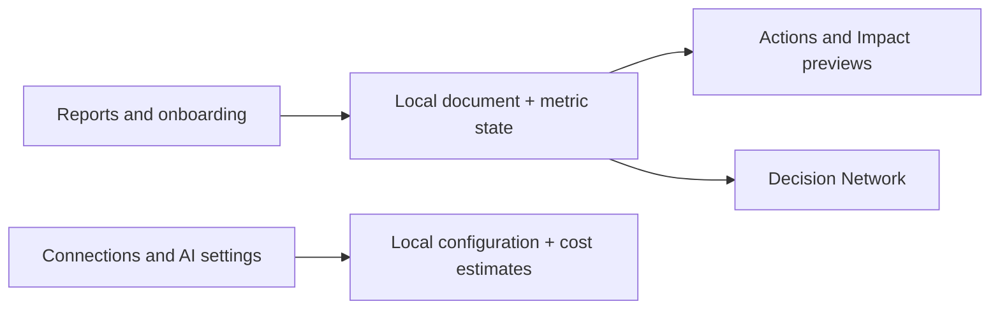

# Proposal D delivery review

## Overview

Proposal D captures the agreed Causent interface in an interactive local prototype: editable reports, shared onboarding, five navigation tabs, a decision network, and Data Workshop connections, harnesses, and task cost. This PR preserves the earlier engineering work and records the GA4 backend handoff. It does not connect customer accounts or deploy the redesign.

[Draft PR #36 and current checks](https://github.com/Causent-AI/causent-ai/pull/36).

## Executive summary

- **UI delivery:** A/B/C comparisons and D are packaged with local assets, editor sources, and review captures. D includes the final labels and removes Instances and the redundant Metric sources section.
- **GA4 handoff:** [The next-PR contract](../../handoffs/ga4-core-metrics.md) defines user authorization, real daily data, core metric selection, analysis integration, and the required infrastructure/frontend security review. Implementation and that review remain pending.

## Next steps

1. Review the UI PR after its parent [engineering PR #35](https://github.com/Causent-AI/causent-ai/pull/35). Retarget this PR to `main` after the parent merges; retain only the UI/documentation delta.
2. Use the GA4 handoff for the next implementation PR, including the security review and a real-property acceptance run. Preserve the existing Impact models.

## Analysis

### Build and verification method

The prototype uses browser JavaScript and bundled Tiptap 3.30.1. It has no server writes or paid AI calls; reload clears edits. Bundled dependency notices are included. The first packaging lint failed on generated vendor code, CommonJS build scripts, and unused source bindings. The fix excludes only generated editor bundles, scopes the CommonJS rule to prototype build scripts, and removes unused bindings. Handwritten sources remain linted.

The existing metric tests now run in CI. Local checks cover both editor builds, 12 prototype tests, typecheck, lint, syntax, asset references, and browser interactions. Hosted checks are reported on the PR; old parent-PR results are not evidence for this commit.

### UI delivery

Reports retain paragraph formatting, charts, editable sections, metric import, core selection, and estimates. Actions retain editing and PR links. The dark Decision Network filters dated decisions by core metric/project/portfolio, supports zoom/pan, and opens summaries. Data Workshop contains Metrics, Connections, and AI; AI contains Connections, Harnesses, and Cost. Connection forms store preview settings only. Saved cost estimates keep their original configuration.

Backend runtime, migrations, workers, and default analysis models are unchanged from the parent. Graph edges show membership/sequence, not causal proof. A/B/C remain comparison references; C's packaging cleanup changes no behavior.

### GA4 handoff

The handoff maps real GA4 observations into the existing metric-definition/observation and recompute contracts. It specifies tenant-bound OAuth, private credentials, complete imports, provider quality flags, and revoked/stale-job handling. The security scope names actual repository boundaries and requires verified findings, regression tests, and disclosure of unchecked infrastructure.

## Appendix

- [Proposal D notes and review steps](../2026-09-07/ui-proposals/d/README.md), [comparison guide](../2026-09-07/ui-proposals/README.md), [original UX review](../2026-09-07/UX_REVIEW.md).
- [Decision Report design](../../designs/ai-assisted-decision-report.md), [engineering standards](../../ENGINEERING.md), [security design](../../designs/security-and-auth.md).
- Reproduce: `npm run test:ui-proposals`, `npm run typecheck`, `npm run lint -- --max-warnings=0`; build the C/D editors with each proposal's `build.cjs`.
- No migration/backfill is required for this PR. Reverting the proposal/docs/tooling commit removes this delivery without altering the parent engineering implementation.
