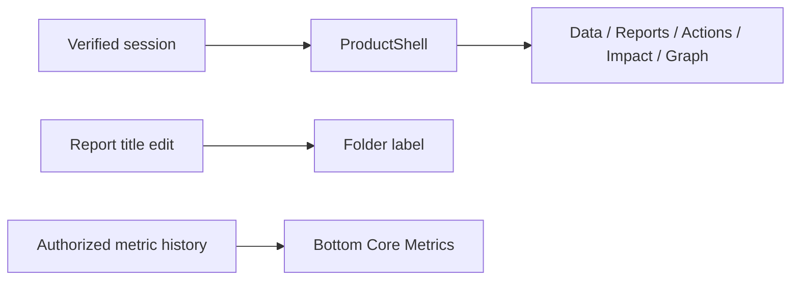
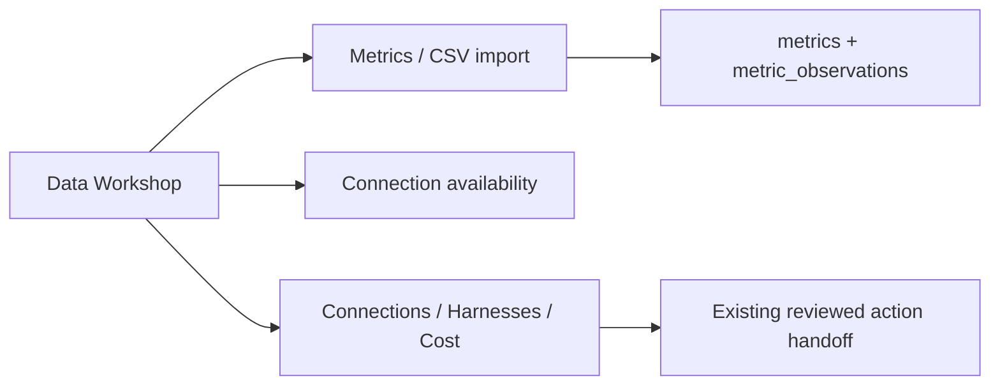
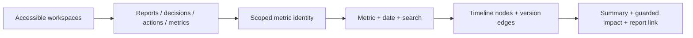
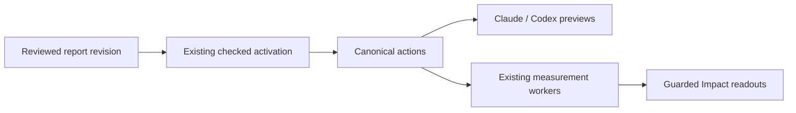

# Proposal D production design

## Overview

This release ports Proposal D into the authenticated Next.js application. A fidelity correction restores the approved page layouts after the initial port proved incomplete. It uses saved reports, real imported observations and authorized workspace data. Existing activation, measurement, provenance and AI budget controls remain in force. Google Analytics stays disabled. The correction passes local verification; final candidate acceptance and promotion remain pending. Release evidence is recorded in the [release manifest](../../releases/2026-09-22-proposal-d-production.md).

## Executive Summary

- **D01 — Navigation:** Five pill tabs, Causent colors, compact blue Create, yellow Ask, synchronized report title and bottom Core Metrics. Onboarding uses the same shell.
- **D02 — Documents:** Pageless paragraph editing, persistent formatting tools, renamed sections, added notes, observed-data charts and explicitly reviewed AI rewrites. Active reports remain immutable; create a new version to edit their plan.
- **D03 — Data Workshop:** A single metric library with latest value, complete-calendar L28 average and WoW trend, a metric upload dialog and bottom history drawer. Metrics, Connections and AI; AI contains Connections, Harnesses and Cost. The cost calculator requires supplied rates. Custom runtime connections, saved custom harnesses and automatic execution remain unimplemented and are labeled accordingly.
- **D04 — Decision Network:** Full dark canvas with a linked core-metric node, project diamonds and authorized decision nodes, explicit version links, core metric and period filters, search, zoom/pan and decision summaries. No combined causal-impact claim is introduced.
- **D05 — Continuity:** Compact expandable actions, four impact tiles and an action-results table retain existing handoffs, manual completion, metric imports and default Impact models remain. Imported GitHub source links are constrained to HTTPS GitHub PR/issue paths. No schema or worker change is required.

## Next Steps

1. Complete candidate acceptance and verify the production alias against the exact release source before declaring the design live.
2. Keep GA4 at **Setup required** until the owner provides a Google account/property and completes the [provider acceptance](../../integrations/google-analytics.md#setup-pending).
3. Treat custom harness persistence, local execution, additional connections, cross-project metric identity and portfolio attribution as separate backend work. The current interface does not simulate these capabilities.

## Analysis

### Design decisions

The approved prototype defines spacing, hierarchy, color and controls. Real records replace sample content. Reports keep meaningful immutable-version controls; measurement views keep attribution caveats. Healthy background status moves into details, while queued/failed updates remain visible. Connections do not claim success without a configured service. Manual harness guides retain the Build, Review and UX review card layout without fabricating saved configurations or provider prices.

Latest local checks: 735 application/database tests, 1,338 engine/RLS/bridge tests, 27 prototype/load tests, types, zero-warning lint and the production build pass. Browser checks cover desktop navigation and mobile Data/onboarding/Graph, source and upload dialogs, and graph details/Fit. The hosted AI/create/edit/activation matrix is still a release gate.

### Build and verification method

The application uses React 19.2.4, Next.js 16.3.5 and Tiptap 3.31.3. Server components load request-scoped data; browser components own editing, filters and chart interaction. The existing Supabase authorization, append-only revision and activation paths remain authoritative. The review used the production-rollout and React checklists, actual local browser interaction, database integration tests, and the engine/RLS/bridge suite.

A stale local server was restarted before visual checks. Local tests initially skipped database cases because network access was unavailable; the decisive run used the verified, isolated 47-migration database. Only optional paid model-polish tests remain skipped. Deployment checks are separate from local checks and founder acceptance.

### D01 — Shared shell

Both route groups use `ProductShell`. The active editor updates the folder label immediately. Navigation performs reads; it never generates or activates a report. Account labels come from the verified session. Ask opens available AI workflows; it does not invent a general chat answer.

### D02 — Documents

Rich text stays in the existing claim presentation contract. Section names, optional notes and chart references live in bounded `documentLayout` metadata on the saved snapshot. They do not become evidence or alter activation claims. The previous production validator accepts and preserves this additive field, so rollback does not make newly edited reports unreadable. All edits use existing conflict-aware autosave. Rewrites reuse the authenticated, budgeted generation path, show a preview and require **Keep**; a stale original paragraph or provider fallback is not silently applied.

```mermaid
flowchart LR
  Edit[Paragraph / section / chart] --> Validate[Bounded schema validation]
  Validate --> Save[Existing authenticated save action]
  Save --> Revision[decision_report_revisions.snapshot]
  Revision --> Reload[Reopened pageless document]
  Request[Explicit rewrite request] --> Budget[Existing generation admission]
  Budget --> Preview[AI proposal]
  Preview --> Keep[User keeps text]
  Keep --> Edit
```

### D03 — Data Workshop

CSV definition, scale, direction and import checks are retained. Connections shows actual availability; GA4 and BigQuery are not represented as connected. The AI area exposes the configured report model and existing manual Claude/Codex handoffs. Cost separates supplied-rate calculations and saved action estimates from billed usage. No pricing feed or billing total is claimed.

### D04 — Decision Network

Nodes use saved decisions/reports and authorized workspaces. Database metric IDs are mapped to UI IDs and namespaced per workspace. Edges show project membership and explicit predecessor links, never inferred causation. A filtered node displays the existing guarded action readout or an honest unavailable state. All-project browsing is available for up to twenty accessible workspaces; larger accounts select a workspace.

### D05 — Continuity and rollback

Actions retain registered-primary versus monitoring-only behavior, completion and both external handoff previews. Plan changes use a successor report so activation history remains intact. The Impact model and workers are unchanged. There is no migration, backfill, destructive cleanup or enabled connector in this release. Rollback restores the prior application artifact while preserving additive document metadata and audit records.

## Appendix

- [Release manifest and verification](../../releases/2026-09-22-proposal-d-production.md)
- [Approved prototype](../2026-09-07/ui-proposals/d/README.md), [UX review](../2026-09-07/UX_REVIEW.md), [engineering handbook](../../ENGINEERING.md), [Decision Report design](../../designs/ai-assisted-decision-report.md)
- Gates: `npm run typecheck`, `npm run lint -- --max-warnings=0`, `npm test`, `npm run test:ui-proposals`, `npm run test:load-contract`, `python -m pytest -q` in `engine`, `npm run build:webpack`, `npm run check:dashboard-build`.
- Operational records contain IDs, counts, check results and non-sensitive diagnostics. New visual interactions add no analytics events. AI requests use existing admission/telemetry; secrets, raw source files and report text are excluded from release logs.
